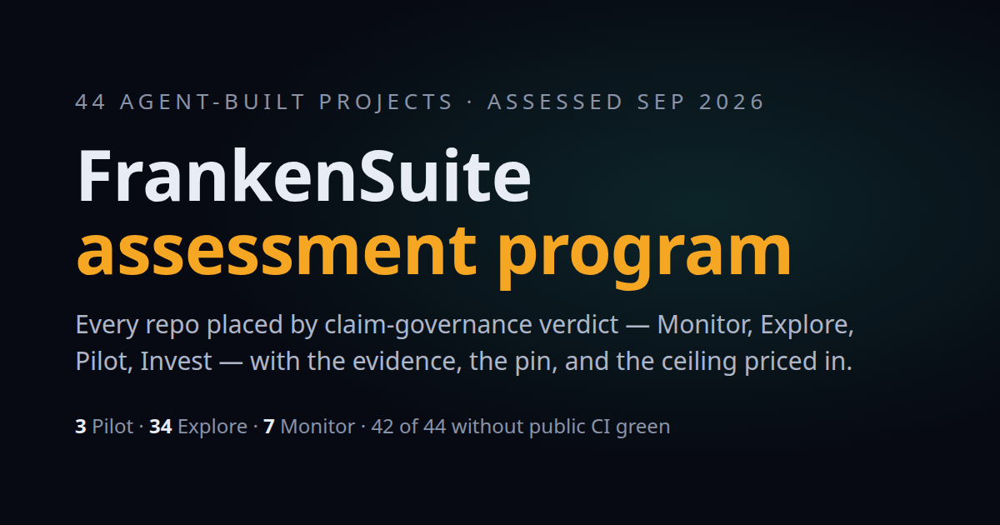

# Franken Research

An independent, evidence-tiered assessment of 44 repositories from Jeffrey Emanuel's FrankenSuite, extended to 21 parts of the wider agent stack: what to adopt, what to copy, and when building from scratch is justified. Published as a static site you can read online or offline.

**Live site: https://fr.zeststream.ai**

[](https://github.com/JYeswak/franken-research/actions/workflows/verify.yml) [](https://github.com/JYeswak/franken-research/actions/workflows/watch.yml) [](https://github.com/JYeswak/franken-research/actions/workflows/deploy.yml)

[](https://fr.zeststream.ai)

Made by Joshua Nowak ([ZestStream](https://zeststream.ai)) with AI coding agents. Not affiliated with or funded by Jeffrey Emanuel; Joshua uses his public tools and is a paying subscriber to jeffreys-skills.md.

Each repository was cloned at a single commit (the "pin"), read against one written protocol ([RULEBOOK.md](RULEBOOK.md)), and written up as a packet in which every substantive claim carries an evidence tier (Verified, CI-observed, Maintainer claim, External, Inference) and a confidence grade. The packets were then synthesized into suite-wide counts, and the site turns both into a map, one brief per repository, and a handful of practitioner pages.

## What we found

All numbers below are counted from the packets and stated in [synthesis/00-overview.md](synthesis/00-overview.md) (assessment date 2026-09-22).

1. **The pin is usually unverifiable or red.** Only 2 of 44 projects show public CI green at the assessed commit (`frankenscipy`, `franken_threed`). 11 are red at the pin, 6 have CI with no verdict for the pin, 11 have no test CI, 8 had CI disabled or deleted, and 6 verify only on the maintainer's private infrastructure. "Green suite" claims mostly rest on local or historical evidence. [CI-observed, High]
2. **Mechanism existence runs ahead of execution.** The suite's real strength is an unusually developed honesty apparatus: negative-evidence ledgers, claim registries, conformance harnesses, differential oracles, fail-closed gates. The same packets document that apparatus often not running where it matters, for example a safety census passing inside a red gate, or quality workflows with zero runs. [CI-observed, High]
3. **The license rider is the structural ceiling.** 38 of 44 repositories carry an MIT license plus a rider that withholds all rights, including benchmarking and testing, from OpenAI, Anthropic, and anyone acting for them. It blocks the two labs most able to validate the work independently and makes the license source-available rather than OSI open source; it does not bar people who use those labs' models on their own projects, which is how the maintainer builds. [Verified, High]

Around those three: bus factor 1 in all 44 [Verified, High], no release or tag in 23 [External, High], and no independent third-party validation found for any of them, within the recall limits of the searches [External, High]. Only one verdict (`franken_threed`, 61 of 61 tests) rests on tests the analyst re-ran [Verified, High].

These are findings about evidence at a pin, not about the maintainer's ability. The briefs credit what is strong, and the honesty apparatus above is the reason many of these findings could be checked at all.

## Beyond the 44: the agent stack

The same evidence rules, applied outside the FrankenSuite to 21 kinds of agent infrastructure (inference engines, MCP, agent frameworks, memory, RAG, vector databases, evals, guardrails, sandboxes, browser and computer use, voice, fine-tuning, and more), using evidence packs covering 192 repositories checked against the GitHub API on 2026-09-23. Each area gets one verdict: **Adopt**, **Adopt and wrap**, **Build clean-room**, or **Watch** ([stack/METHOD.md](stack/METHOD.md)).

- **20 of 21 areas are Adopt and wrap; 1 (computer use) is Watch; none justifies building from scratch.** In every adopted area the incumbents exist, and in every one the evidence shows a verification gap you have to close yourself: an unrun conformance suite, no replay harness, no false-positive norm for guardrails, no filtered-recall suite for vector search. It is the same "mechanism ahead of execution" finding as above, one layer out. [Inference; 13 verdicts Medium confidence, 8 Low, none High, because no evidence pack ran the software it describes]
- **Licenses are checked, not assumed.** All 101 projects the verdicts recommend were license-checked; 13 carry non-permissive terms (AGPL-3.0, SSPL, Elastic License 2.0, open-core enterprise directories, field-of-use conditions), and each verdict names them where it recommends the project ([stack/licenses.tsv](stack/licenses.tsv)).
- **Every verdict was reviewed by someone other than its author**, and signed only after the author fixed the findings. Authors and reviewers were separate AI agent sessions, each working from the files alone; a human maintainer coordinated the work and ruled on disputes. That is independence of context, not independent third-party review, which no verdict has had yet. The review records, including the rounds where reviewers refused to sign, are in [stack/reviews/](stack/reviews/).

**Rigor practices worth copying.** [stack/rigor-practices.tsv](stack/rigor-practices.tsv) indexes 136 practices found across the 44 packets and the 192 ecosystem repositories, each quoted from its source, mapped onto the starter kit, and marked for this repository: 15 adopted, 21 partial, 23 candidate, 77 not applicable. We first claimed 36 adopted; an independent audit found most of those were partial, and the index now says so.

**Since the pin.** Verdicts describe each repository at its pin. [updates/](updates/) holds a dated census of what moved afterwards (32 of 44 repositories had new commits by 2026-09-24) and re-checks for material changes, such as `franken_code_browser` shipping a notarized developer-preview app the day after its pin. Pins and headline counts are never edited in place.

**Daily watch.** Every morning a scheduled job ([watch/](watch/README.md)) reads the GitHub API for all 44 assessed repositories and every public repository their maintainer owns, and commits a dated census to `watch/census/` only if the whole gate chain passes. The site shows the result live ("Daily watch, 2 h ago: ...") and redeploys itself after each run. A new release or tag, a license or LICENSE-text change, a removed workflow file or a first one where there were none, an archived, renamed, or deleted repository, a pin rewritten out of history, or a new `franken*` or Rust repository opens a GitHub issue; commits and added workflow files alone never do. The watch does not judge: an analyst triages each issue, and anything that could move a cell gets a dated, independently reviewed re-check under [updates/METHOD.md](updates/METHOD.md). The first two, `franken_code_browser`'s first release and `frankengit` retiring 71 of its 78 GitHub workflows, are in [updates/](updates/).

**Weekly discovery.** Every Monday a second job ([watch/discover.mjs](watch/discovery/README.md)) searches GitHub for active public Rust projects with agent-built signals (an `AGENTS.md` or `CLAUDE.md`, agent co-author trailers) and files one rollup issue of candidates. Nothing is assessed without triage against the [screening rule](candidates/README.md); accepted candidates get a packet under the same Rulebook, land as a dated cohort, and never change the pinned 44.

## Check your own repo

The method ships as a starter kit: templates, the 28-item checklist, scripts, and a commit hook.

```bash
git clone https://github.com/JYeswak/franken-research.git
cd franken-research/starter-kit
```

Then follow [the starter kit page](https://fr.zeststream.ai/starter-kit/). Do not run `scripts/init.sh` inside a repository that already has an `AGENTS.md` or a live commit hook; the page explains what to copy by hand instead.

## Explore

| Page | What it is for | Who it helps |
|---|---|---|
| [The map](https://fr.zeststream.ai/) | All 44 repositories placed by assessment ring, with a table view and one-click access to every brief. | Anyone deciding where to look first. |
| [Briefs](https://fr.zeststream.ai/) | One page per repository: verdict, what it teaches, what would change the verdict, and a link to its full packet. | Evaluators and the projects' own users. |
| [Method](https://fr.zeststream.ai/method/) | How claims are governed: the 12-section packet, the five evidence tiers, and machine-checked citations into the packets. | Readers who want to know how far to trust a verdict. |
| [Techniques](https://fr.zeststream.ai/techniques/) | Claim-governance and measurement techniques observed in the suite, each with a falsification experiment. | Engineers who want to borrow what works. |
| [Failure modes](https://fr.zeststream.ai/failure-modes/) | Patterns that recurred across the suite, with exact counts and named instances. | Teams building with coding agents who want to avoid the same drift. |
| [Reproduce a verdict](https://fr.zeststream.ai/reproduce/) | The procedure for re-deriving a verdict at its pin, with a worked example. | Skeptics and independent reviewers. |
| [Starter kit](https://fr.zeststream.ai/starter-kit/) | Templates, checklists, and scripts for running the same method on your own project. | Anyone starting an agent-built project. |
| [Agent stack](https://fr.zeststream.ai/stack/) | Adopt, copy, or build verdicts for 21 parts of the agent stack, with licenses and cited evidence. | Anyone choosing agent infrastructure. |
| [Rigor practices](https://fr.zeststream.ai/rigor/) | 136 practices worth copying, where each is evidenced, and whether this repository does it. | Teams hardening their own process. |
| [Beyond FrankenSuite](https://fr.zeststream.ai/beyond/) | What big-vendor agent-assisted Rust ports and outside validation teach. | Engineers porting or rewriting with agents. |
| [Updates](https://fr.zeststream.ai/updates/) | What moved in the 44 repositories since their pins, and dated re-checks. | Anyone quoting a verdict today. |
| [Follow](https://fr.zeststream.ai/follow/) | The Atom feed of releases, re-checks, and daily censuses, and an OPML file for following all 44 repositories. | Anyone who wants to know when something changes. |

## Graded by our own method

A repository that reports these findings should pass the same checks. [The self-assessment page](https://fr.zeststream.ai/self/) scores Franken Research on the master matrix columns: TRL, ring, license (MIT, no rider), bus factor (1: one maintainer, and help is welcome), contribution policy (open), CI at the pin (the badge above, not a claim), release posture (tagged releases; see [Releases](https://github.com/JYeswak/franken-research/releases)), and independent validation (none yet). It also lists what we got wrong or cannot prove.

## Get involved

Every page on the site has a "Suggest a fix or an idea" link that opens a GitHub issue form with the page already filled in. You can also open one directly:

- [Correction](https://github.com/JYeswak/franken-research/issues/new?template=correction.yml): a claim you think is wrong, with your evidence and its tier.
- [New evidence](https://github.com/JYeswak/franken-research/issues/new?template=new-evidence.yml): a release, CI result, or license change the daily watch missed.
- [Suggest a project](https://github.com/JYeswak/franken-research/issues/new?template=suggest-project.yml): a public project that should be assessed.
- [Idea](https://github.com/JYeswak/franken-research/issues/new?template=idea.yml) or [site problem](https://github.com/JYeswak/franken-research/issues/new?template=site-bug.yml).

A bot replies with what happens next. An analyst triages it; a verdict change is written as a dated re-check and reviewed by a separate agent session before a human merges it; accepted contributions are credited in [CHANGELOG.md](CHANGELOG.md), and the site redeploys on merge. The whole loop is in [docs/PIPELINE.md](docs/PIPELINE.md).

To follow along, subscribe to the [Atom feed](https://fr.zeststream.ai/feed.xml) (releases, re-checks, and the daily census), or import [the OPML file](https://fr.zeststream.ai/follow/franken-suite.opml) to follow the releases and tags of all 44 repositories in your reader. See [/follow/](https://fr.zeststream.ai/follow/).

## Reproduce

Requirements: git, [Bun](https://bun.sh), python3, node, and Google Chrome or Chromium. The render gate looks in the usual install locations; set `CHROME_PATH` if your browser lives elsewhere.

```bash
git clone https://github.com/JYeswak/franken-research.git
cd franken-research
bun install --frozen-lockfile
bun run verify
```

`bun run verify` runs `site/scripts/verify-site.sh`, the same command CI runs. It prints one PASS or FAIL line per gate below (gate K prints one line for each of its checks) and exits nonzero if any fails:

| Gate | Proves |
|---|---|
| A | Every packet and the Rulebook under `site/` is byte-identical to the canonical copy at the repo root. |
| A2 | Every method-page citation resolves to a real claim-table line in a shipped packet and quotes it correctly. |
| B | Every suite number on the site is computed from `site/assets/data.js`, its no-JS fallback matches, and no bare count is typed into copy. |
| C | NODUS, TRL, CI, the rider, the pin, and bus factor are defined before first use on every page. |
| D | Every brief pairs with exactly one packet, and the data file names the same 44. |
| E | Every internal link and anchor resolves offline. |
| F | Every file a page references ships. |
| G | Pages stay keyboard-operable, with no-JS, no-WebGL, and reduced-motion fallbacks. |
| H | Copy passes a slop scan (em-dash density, filler words, unsupported superlatives). |
| I | Representative pages (front door, method, a brief, lessons, self, and the new stack, rigor, beyond, and updates pages) render in headless Chrome from `file://` at desktop and phone widths with zero console errors and zero horizontal overflow. |
| J | No page references removed scaffolding. |
| K | The agent-stack layer holds up: every verdict has the required fields and an independent reviewer's signature (K1); every citation resolves and its quoted text is on the cited line (K2); every rigor-practice source quote and every adopted or partial proof resolves (K3); the generated pages equal a fresh run of the generator (K4); every adopted project has a license row, and non-permissive licenses are named where they are recommended (K5). |
| L | No personal email address appears in any tracked file. |
| W | The daily watch's change detection holds offline: recorded GitHub API responses go through the same code the scheduled run uses, and a new release, a LICENSE text change with the same SPDX id, a removed workflow, a rename, and an unreachable pin are flagged, while commits and added workflow files alone are not. |
| W2 | The weekly discovery sweep scores, orders, and excludes candidates correctly on recorded search responses, and its output carries no names or email addresses. |
| M | The Atom feed and the follow-the-suite OPML equal a fresh `bun run build:feed` and parse as well-formed XML. |
| S | Every page carries the shared navigation, footer, and head regions exactly as `bun run build:shell` renders them, and the page list matches the sitemap. |

CI also runs `bun run build:map` and fails if the committed `site/assets/app.bundle.js` differs from what its source builds, and scans the tree and history for secrets with gitleaks. Every push to `main` that passes the gates deploys the site and smoke-tests the deployment ([deploy.yml](.github/workflows/deploy.yml)). [site/BUILD-GATES.md](site/BUILD-GATES.md) explains why each gate exists.

What the gates prove is that the site says what the packets say, consistently and reachably. They do not prove the packets are right; for that, follow [Reproduce a verdict](https://fr.zeststream.ai/reproduce/) against a real repository.

## Repository layout

| Path | Contents |
|---|---|
| `packets/` | The 44 assessment packets, one per repository, each pinned to a commit. The primary evidence. |
| `synthesis/` | Suite-wide synthesis: aggregate counts and master matrix (`00-overview.md`), CI requirements, failure patterns, cross-pollination, uniqueness, external validation, and per-repo cross-suite briefs. |
| `RULEBOOK.md` | The assessment protocol: evidence tiers, source hierarchy, packet template, ring rules. |
| `starter-kit/` | The method packaged for reuse: templates, checklists, scripts. |
| `ecosystem/` | Design notes on how the pieces fit, the A-Z playbook, and the project-pickup planning system. |
| `stack/` | The agent-stack layer: the method, 21 verdicts, the license census, the rigor-practices index, and the review records. |
| `updates/` | Dated movement census and re-checks since the pins. Pins are never edited in place. |
| `watch/` | The daily watch and weekly discovery sweep: the scripts, the latest state and summary, one census and one change file per day, weekly candidate lists, and the fixtures gates W and W2 replay. |
| `candidates/` | The screening rule for projects outside the 44. |
| `docs/` | The contribution pipeline, from issue to deploy. |
| `.github/` | CI, deploy, watch, discovery, and triage workflows, and the issue forms. |
| `site/` | The static site served at fr.zeststream.ai. Runs from `file://` with no build step; `site/packets/` and `site/RULEBOOK.md` are byte-identical copies checked by gate A, and `site/stack/` and `site/rigor/` are generated from `stack/` by `node site/scripts/make-stack.mjs` (gate K4 checks they match). |

## Corrections and right of reply

If you maintain an assessed project, or you find an error, open a [correction](https://github.com/JYeswak/franken-research/issues/new?template=correction.yml). Cite the packet file and line, what it gets wrong, and your evidence with its tier. [CONTRIBUTING.md](CONTRIBUTING.md) has the details.

How corrections are handled:

- Packets are the dated record of what was observed at a pin. They are not silently rewritten.
- An accepted correction is recorded in [CHANGELOG.md](CHANGELOG.md) with the date, the issue, and what changed. If it changes a number or a verdict, the data file, the brief, and every page that shows the number change in the same commit, and the gate chain must pass.
- A correction we decline gets a reply on the issue explaining why, with the evidence we relied on.
- Maintainers of assessed projects may post a reply to their brief; we will link it from that brief.

## Data notes

- Maintainer commit email addresses quoted from public git metadata are redacted in the packets, their site copies, and one synthesis brief, in every commit of this repository's history: the history was rewritten on 2026-09-23 so that no published commit contains them ([old-to-new commit map](stack/reviews/history-rewrite-2026-09-23.tsv)). No other evidence text was changed.
- Commit-author email addresses are never recorded in the movement census either; gate L fails the build if a personal address appears in any tracked file.
- Everything else is as assessed on 2026-09-22, at each repository's pin. The FrankenSuite moves fast; check the pin date before quoting a verdict.
- The site's data file classifies one repository's CI (`frankenjax`) differently from the synthesis matrix. The difference is disclosed on the method page and changes no headline number.

## License

MIT, no rider. See [LICENSE](LICENSE). Anyone may use, benchmark, test, or index this work.
