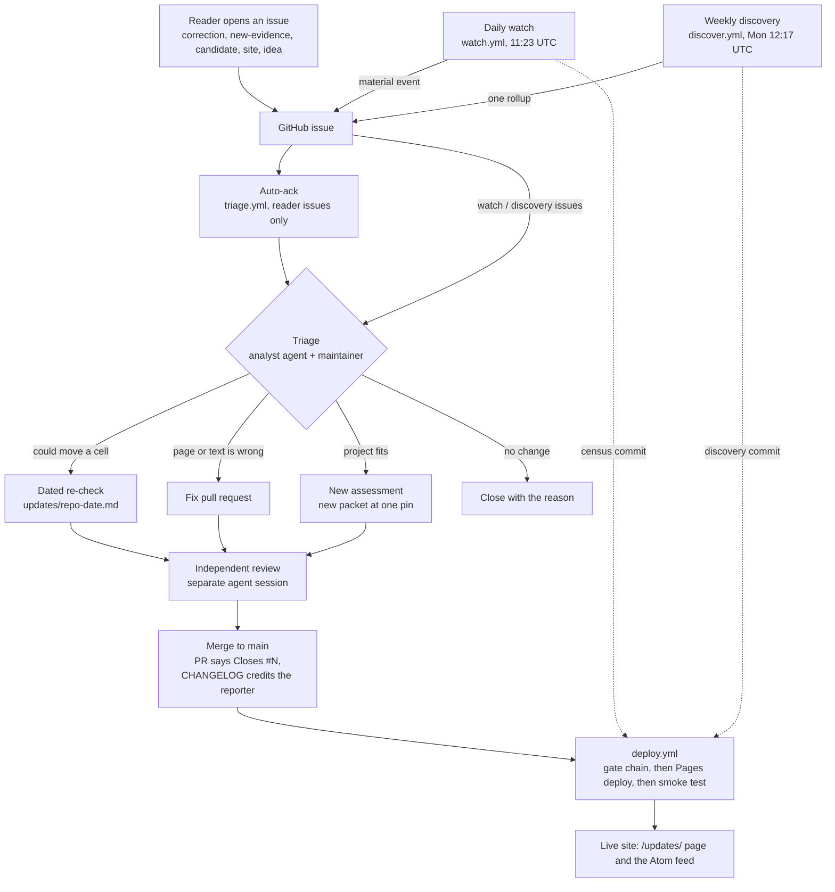

# The update pipeline

How a change reaches https://fr.zeststream.ai: where it starts, who handles each step, where each
artifact lives, and what runs by itself. The packets stay frozen at their pins throughout; what
changes after a pin is recorded beside them under the rules in
[updates/METHOD.md](../updates/METHOD.md) and [RULEBOOK.md](../RULEBOOK.md).

## The loop



1. **An issue is opened.** A reader uses one of the forms in `.github/ISSUE_TEMPLATE/` (see
   [CONTRIBUTING.md](../CONTRIBUTING.md)); each form sets one label. The daily watch
   ([watch/README.md](../watch/README.md)) opens one issue per new material event, labelled `watch`
   plus the event type. The weekly discovery sweep opens one rollup issue a week, labelled
   `candidate` and `discovery`.
2. **Auto-ack.** [triage.yml](../.github/workflows/triage.yml) posts one comment on a reader issue:
   who reviews it, what the possible outcomes are, and a link here. It reads only the issue number
   and labels, and posts only once (the comment carries a hidden marker). Watch and discovery
   issues, and blank issues without a label, get no comment. The text is in
   [.github/scripts/triage-ack.mjs](../.github/scripts/triage-ack.mjs).
3. **Triage.** An analyst agent reads the issue against the evidence and says which outcome fits;
   the maintainer decides. Every issue ends in one of four ways:
   - a **dated re-check** (`updates/<repo>-YYYY-MM-DD.md`, pinned to the new commit), when the
     event or evidence could move a matrix cell;
   - a **fix** pull request, when a page, number, or sentence is wrong at the pin;
   - a **new assessment** (a new packet pinned to one commit, with its brief), for an accepted
     candidate;
   - a **close with the reason** written on the issue.
4. **Independent review.** Anything that changes a verdict, a number, or a matrix cell is reviewed
   by a separate agent session that did not write it, before merge; the pull request template asks
   for the link. A fix that changes no verdict is reviewed by the maintainer and the gate chain.
5. **Merge.** The pull request body says `Closes #N`, so the issue closes on merge. An accepted
   correction, piece of evidence, suggestion, or report gets a line in
   [CHANGELOG.md](../CHANGELOG.md) under Unreleased, in the same pull request, with the date, the
   issue link, what changed, and the reporter's handle.
6. **Deploy.** [deploy.yml](../.github/workflows/deploy.yml) runs on every push to `main`, after
   every successful watch or discovery run (their bot commits do not trigger push workflows), and
   on demand. It runs the full gate chain on the exact commit and deploys `site/` to Cloudflare
   Pages only if every gate passes; a failed gate leaves the site on the previous deploy. Then it
   smoke-tests what a GitHub runner can reach. The new deployment's own `*.pages.dev` URL must
   serve the homepage with the committed `<title>` and one brief. The Pages API must report that
   deployment as the project's canonical and latest production deployment, for this commit, with
   `fr.zeststream.ai` an active custom domain. Last, `fr.zeststream.ai` itself is fetched: 200
   passes, and 403 is only a notice, because the zone's bot protection blocks the runner's
   datacenter IPs; a 404 or 5xx fails. A failed smoke test fails the run after the deploy, so roll
   back from the Pages dashboard if the site is wrong.
7. **Announce.** The site's [Updates page](https://fr.zeststream.ai/updates/) lists re-checks and
   census results, and the Atom feed (`site/feed.xml`, served at `/feed.xml`) is regenerated by
   `bun run build:feed` from CHANGELOG release sections, `updates/`, and `watch/census/`. Gate M
   fails if the committed feed differs from a fresh build, so a change that adds one of those
   inputs must rebuild the feed in the same commit.

## Who owns each step

| Step | Owner | Automatic? |
|---|---|---|
| Daily watch, its issues and census commit | `watch.yml` (bot, `GITHUB_TOKEN`) | Yes |
| Weekly discovery rollup and its commit | `discover.yml` (bot, `GITHUB_TOKEN`) | Yes |
| Acknowledgement comment | `triage.yml` (bot) | Yes |
| Triage decision | Analyst agent proposes, maintainer decides | No |
| Re-check, fix, or new packet | Analyst agent | No |
| Independent review | A separate agent session, never the author | No |
| Merge, CHANGELOG credit | Maintainer | No |
| Gates, deploy, smoke test | `deploy.yml` (bot, Cloudflare token) | Yes |
| Updates page and feed | Rebuilt in the commit that adds their inputs; published by `deploy.yml` | Build by hand, publish automatic |

## Where each artifact lives

| Artifact | Path |
|---|---|
| Pinned assessments (frozen) | `packets/`, `synthesis/`, `RULEBOOK.md`, with byte-identical copies in `site/` |
| Re-check rules and dated re-checks | `updates/METHOD.md`, `updates/<repo>-YYYY-MM-DD.md`, `updates/movement-YYYY-MM-DD.tsv` |
| Daily watch state, census, changes | `watch/state.json`, `watch/census/YYYY-MM-DD.tsv`, `watch/changes/YYYY-MM-DD.json` |
| Weekly discovery results | `watch/discovery/<YYYY-Www>.json` |
| Issue forms, acknowledgement text | `.github/ISSUE_TEMPLATE/`, `.github/scripts/triage-ack.mjs` |
| Workflows | `.github/workflows/verify.yml`, `watch.yml`, `discover.yml`, `triage.yml`, `deploy.yml` |
| Credits and corrections | `CHANGELOG.md` |
| Gate definitions | `site/scripts/verify-site.sh`, described in [site/BUILD-GATES.md](../site/BUILD-GATES.md) |
| Published site | `site/`, deployed to the Pages project `franken-assessments` |

## One-time setup

Deploys need a Cloudflare API token that can do one thing: edit Pages on the zeststream account.
Until it exists, `deploy.yml` still runs every gate, then skips the deploy with a warning and
stays green.

1. In the Cloudflare dashboard, open **Manage Account > Account API Tokens > Create Token**, and
   choose **Create Custom Token**.
2. Name it `franken-research deploy`. Add one permission: **Account / Cloudflare Pages / Edit**.
   Under Account Resources, include only the zeststream account. Leave everything else empty and
   create the token.
3. Store it as a repository secret. Run the command below and paste the token at the prompt; never
   put the token on the command line, where it lands in shell history.

   ```bash
   gh secret set CLOUDFLARE_API_TOKEN -R JYeswak/franken-research
   ```

4. The account id is not a secret and is already set as a repository variable. To set it again:

   ```bash
   gh variable set CLOUDFLARE_ACCOUNT_ID -R JYeswak/franken-research --body 68f10e16c42371bd36bfb0738786325c
   ```

   If the variable is ever missing, `deploy.yml` falls back to the same id.
5. Check it: `gh workflow run deploy.yml -R JYeswak/franken-research`, then
   `gh run watch -R JYeswak/franken-research`. The run should end with the smoke test's `OK:` line.

To rotate the token, create a new one the same way, run step 3 again, and delete the old token in
the dashboard.
